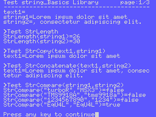
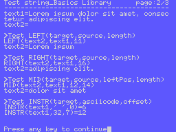
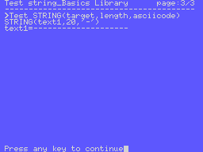

# String Basics SDCC Library (fR3eL project)

<table>
<tr><td>Name</td><td>string_Basics</td></tr>
<tr><td>Architecture</td><td>MSX</td></tr>
<tr><td>Environment</td><td>ROM, MSX BASIC or MSX-DOS</td></tr>
<tr><td>Format</td><td>SDCC Relocatable object file (.rel)</td></tr>
<tr><td>Programming language</td><td>C and Z80 assembler</td></tr>
<tr><td>Compiler</td><td>SDCC v4.4</td></tr>
</table>

---

## Description

C function library with basic functions for the managing C Strings.
Include functions similar to those of the MSX BASIC.

You can use this library to develop applications for ROM, MSXBASIC or MSX-DOS environments, using the Small Device C Compiler [(SDCC)](http://sdcc.sourceforge.net/) cross compiler.

You can access the documentation here with [`How to use the library`](docs/HOWTO.md).

In the source code [`examples/`](examples/), you can find applications for testing and learning purposes.

These libraries are part of the [MSX fR3eL Project](https://github.com/mvac7/SDCC_MSX_fR3eL).

This project is open source under the [MIT license](LICENSE).
You can add part or all of this code in your application development or include it in other libraries/engines.

Enjoy it!

 

---

## History of versions
(dd/mm/yyyy)

- v1.2 (12/ 1/2025) Update to SDCC (4.1.12) Z80 calling conventions
- v1.1 (20/12/2023) Rename some functions and remove SPACE
- v1.0 (24/07/2018)< First version 

 

---

## Requirements

- [Small Device C Compiler (SDCC) v4.4](http://sdcc.sourceforge.net/)
- [Hex2bin v2.5](http://hex2bin.sourceforge.net/)

 

---

## Quick Function Guide

See the [How to](docs/HOWTO.md) document for more information and examples.

### Functions similar to those in the C standard string library

| Name  | Declaration  | Output | Description |
| :---  | :---         | :---   | :---        |
| StrLength | `StrLength(text)` | `char` | Returns the length of a string |
| StrCopy | `StrCopy(targetString, sourceString)` | - | Copy the source string on the target string |
| StrConcatenate | `StrConcatenate(targetString, sourceString)` | - | Appends a copy of the source string to the target string |
| StrCompare | `StrCompare(string1, string2) ` | `char` or defType `boolean` | Compare two strings |

 

### Functions similar to MSX BASIC instructions:

| Name   | Declaration  | Output | Description |
| :---   | :---         | :---   | :---        |
| LEFT   | `LEFT(targetString, sourceString, length)` | -      | Returns a section of the source string with the given length |
| RIGHT  | `RIGHT(targetString, sourceString, rightLength)`    | - | Returns a section to the right of the source string with the given length |
| MID    | `MID(targetString, sourceString, leftPos, length)`  | - | Returns a section of the source string from the given position and length |
| INSTR  | `INSTR(sourceString, ASCIIcode, offset)`   | `char` | Find the first occurrence of a character in the given string |
| STRING | `STRING(targetString, length, ASCIIcode)`  | -      | Generates a string, composed with same char |

 

---

## Code Examples

The project includes several examples that I have used to test the library and that can help you learn how to use this library.

You can find them in the [`examples/`](examples/) folder.

 

### Example 1

Example where all the functions of the _string_Basics_ library are tested in the ROM environment.

[`examples/Test01`](examples/Test01)

 
 
 

 

---

## References

- Wikipedia · [C String Handling](https://en.wikipedia.org/wiki/C_string_handling)
- [C Programming](https://en.wikibooks.org/wiki/C_Programming) · [String manipulation](https://en.wikibooks.org/wiki/C_Programming/String_manipulation)
- w3schools · [C Strings](https://www.w3schools.com/c/c_strings.php)