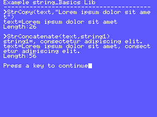

# How to use the string_Basics SDCC Library

| Attention! |
| :---       |
| The following document has been written using an English translator.<br/>You can participate in the improvement of this document, transmitting your corrections or suggestions in the issues of this project or the main fR3eL project.<br/>Thanks for understanding. |

<br/>

## Index

- [1 Description](#1-Description)
- [2 Requirements](#2-Requirements)
- [3 Definitions](#3-Definitions)
	- [3.1 boolean type](#31-boolean-type)
- [4 Functions](#4-Functions)
	- [4.1 StrLength](#41-StrLength)
	- [4.2 StrCopy](#42-StrCopy)
	- [4.3 StrConcatenate](#43-StrConcatenate)
	- [4.4 StrCompare](#44-StrCompare)
	- [4.5 LEFT](#45-LEFT)
	- [4.6 RIGHT](#46-RIGHT)
	- [4.7 MID](#47-MID)
	- [4.8 INSTR](#48-INSTR)
	- [4.9 STRING](#49-STRING)
- [5 Code Example](#5-Code-Example)	
	- [5.1 Example01.c](#51-Example01.c)
- [6 Author's note](#6-Author's-note)
- [7 References](#7-References)

<br/>

---

## 1 Description

C function library with basic functions for the managing C Strings.
Include functions similar to those of the MSX BASIC.

You can use this library to develop applications for ROM, MSXBASIC or MSX-DOS environments, using the Small Device C Compiler [(SDCC)](http://sdcc.sourceforge.net/) cross compiler.

These libraries are part of the [MSX fR3eL Project](https://github.com/mvac7/SDCC_MSX_fR3eL).

This project is open source under the [MIT license](LICENSE).
You can add part or all of this code in your application development or include it in other libraries/engines.

<br/>

---

## 2 Requirements

- [Small Device C Compiler (SDCC) v4.4](http://sdcc.sourceforge.net/)
- [Hex2bin v2.5](http://hex2bin.sourceforge.net/)


<br/>

---

## 3 Definitions

### 3.1 boolean type

Label | Value
----- | -----
false | 0
true  | 1


<br/>

---

## 4 Functions

### 4.1 StrLength

<table>
<tr><th colspan=3 align="left">StrLength</th></tr>
<tr><td colspan=3>Returns the length of a string</td></tr>
<tr><th>Function</th><td colspan=2>StrLength(source)</td></tr>
<tr><th>Input</th><td>char*</td><td>string</td></tr>
<tr><th>Output</th><td>char</td><td>length</td></tr>
</table>

#### Example:
```c
	char result;
	result=StrLength("Hello World!");	//result=12
```

<br/>

### 4.2 StrCopy

<table>
<tr><th colspan=3 align="left">StrCopy</th></tr>
<tr><td colspan=3>Copy the source string on the target string</td></tr>
<tr><th>Function</th><td colspan=2>StrCopy(target, source)</td></tr>
<tr><th rowspan=2>Input</th><td>char*</td><td>target string</td></tr>
<tr><td>char*</td><td>source string</td></tr>
<tr><th>Output</th><td colspan=2>-</td></tr>
</table>

#### Example:
```c
	char text[60];
	char string1[] = "Lorem ipsum dolor sit amet";
	StrCopy(text,string1);
```

Or:

```c
	char text[60];
	StrCopy(text,"Lorem ipsum dolor sit amet");
```

#### Result:
text=`Lorem ipsum dolor sit amet`

<br/>

### 4.3 StrConcatenate

<table>
<tr><th colspan=3 align="left">StrConcatenate</th></tr>
<tr><td colspan=3>Appends a copy of the source string to the target string</td></tr>
<tr><th>Function</th><td colspan=2>StrConcatenate(target, source)</td></tr>
<tr><th rowspan=2>Input</th><td>char*</td><td>target string</td></tr>
<tr><td>char*</td><td>source string</td></tr>
<tr><th>Output</th><td colspan=2>-</td></tr>
</table>

#### Example:
```c
	char text[60] = "Lorem ipsum dolor sit amet";	/*The Array must have a minimum size equal
														  to the sum of the two texts plus one.*/
	char string1[] = ", consectetur adipiscing elit.";
	StrConcatenate(text,string1);
```

#### Result:
text=`Lorem ipsum dolor sit amet, consectetur adipiscing elit.`


<br/>

### 4.4 StrCompare

<table>
<tr><th colspan=3 align="left">StrCompare</th></tr>
<tr><td colspan=3>Compare two strings</td></tr>
<tr><th>Function</th><td colspan=2>StrCompare(string1, string2)</td></tr>
<tr><th rowspan=2>Input</th><td>char*</td><td>first string</td></tr>
<tr><td>char*</td><td>second string</td></tr>
<tr><th>Output</th><td>boolean</td><td>result</td></tr>
</table>

#### Example:
```c
	boolean result;
	result = StrCompare("turboR","MSX3");		//must return false
	result = StrCompare("TMS9918A","tms9918a");	//must return false
	result = StrCompare("1234567890","1234");	//must return false
	result = StrCompare("EqU4L","EqU4L");		//must return true
```

<br/>

### 4.5 LEFT

<table>
<tr><th colspan=3 align="left">LEFT</th></tr>
<tr><td colspan=3>Returns a section of the source string with the given length<br/>Similar as MSX BASIC instruction LEFT$</td></tr>
<tr><th>Function</th><td colspan=2>LEFT(target, source, length)</td></tr>
<tr><th rowspan=3>Input</th><td>char*</td><td>target string</td></tr>
<tr><td>char*</td><td>source string</td></tr>
<tr><td>char</td><td>length</td></tr>
<tr><th>Output</th><td colspan=2>-</td></tr>
</table>

#### Example:
```c
	char text[60];
	char string1[] = "Lorem ipsum dolor sit amet, consectetur adipiscing elit.";
	LEFT(text,string1,11);
```

#### Result:
text=`Lorem ipsum`

<br/>

### 4.6 RIGHT

<table>
<tr><th colspan=3 align="left">RIGHT</th></tr>
<tr><td colspan=3>Returns a section to the right of the source string with the given length.<br/>Similar as MSX BASIC instruction RIGHT$</td></tr>
<tr><th>Function</th><td colspan=2>RIGHT(target, source, length)</td></tr>
<tr><th rowspan=3>Input</th><td>char*</td><td>target string</td></tr>
<tr><td>char*</td><td>source string</td></tr>
<tr><td>char</td><td>length</td></tr>
<tr><th>Output</th><td colspan=2>-</td></tr>
</table>

#### Example:
```c
	char text[60];
	char string1[] = "Lorem ipsum dolor sit amet, consectetur adipiscing elit.";
	RIGHT(text,string1,16);
```

#### Result:
text=`adipiscing elit.`

<br/>

### 4.7 MID

<table>
<tr><th colspan=3 align="left">MID</th></tr>
<tr><td colspan=3>Returns a section of the source string from the given position and length.<br/>Similar as MSX BASIC instruction MID$</td></tr>
<tr><th>Function</th><td colspan=2>MID(target, source, leftPos, length)</td></tr>
<tr><th rowspan=4>Input</th><td>char*</td><td>target string</td></tr>
<tr><td>char*</td><td>source string</td></tr>
<tr><td>char</td><td>position</td></tr>
<tr><td>char</td><td>length</td></tr>
<tr><th>Output</th><td colspan=2>-</td></tr>
</table>

#### Example:
```c
	char text[60];
	char string1[] = "Lorem ipsum dolor sit amet, consectetur adipiscing elit.";
	MID(text,string1,12,14);
```

#### Result:
text=`dolor sit amet`

<br/>

### 4.8 INSTR

<table>
<tr><th colspan=3 align="left">INSTR</th></tr>
<tr><td colspan=3>Find the first occurrence of a character in the given string.<br/>Similar as MSX BASIC instruction INSTR</td></tr>
<tr><th>Function</th><td colspan=2>char INSTR(source, asciicode, offset)</td></tr>
<tr><th rowspan=3>Input</th><td>char*</td><td>source string</td></tr>
<tr><td>char</td><td>ascii code</td></tr>
<tr><td>char</td><td>offset</td></tr>
<tr><th>Output</th><td>char</td><td>position</td></tr>
</table>

#### Example:
```c
	char result;
	char string1[] = "Lorem ipsum dolor sit amet, consectetur adipiscing elit.";
	result=INSTR(string1,' ',0);	//result=6
	result=INSTR(string1,32,7);		//result=12
```

<br/>

### 4.9 STRING

<table>
<tr><th colspan=3 align="left">STRING</th></tr>
<tr><td colspan=3>Generates a string, composed with same char.<br/>Similar as MSX BASIC instruction STRING$</td></tr>
<tr><th>Function</th><td colspan=2>STRING(target, length, asciicode)</td></tr>
<tr><th rowspan=3>Input</th><td>char*</td><td>target string</td></tr>
<tr><td>char</td><td>length</td></tr>
<tr><td>char</td><td>asciicode</td></tr>
<tr><th>Output</th><td colspan=2>--</td></tr>
</table>

#### Example:
```c
	char stringLine[40];
	STRING(stringLine,40,'-');
```

#### Result:
text=`----------------------------------------`


<br/>

---

## 5 Code Example

### 5.1 Example01.c

In this source code you will find a simple example of how to use this library.

You can find the source code on the project's git.

Requires the following items:
- Startup file for MSX 8/16K ROM [crt0_MSX816kROM4000](https://github.com/mvac7/SDCC_startup_MSX816kROM4000)
- string_Basics Library
- [textmode_MSXBIOS](https://github.com/mvac7/fR3eL_textmode_MSX_Lib) Library

<br/>

And you need the following applications to compile and generate the final ROM:
- [Small Device C Compiler (SDCC) v4.4](http://sdcc.sourceforge.net/)
- [Hex2bin v2.5](http://hex2bin.sourceforge.net/)

<br/>



<br/>

#### Source Code:

```c
/* =============================================================================
# Example01

- Version: 1.0
- Architecture: MSX
- Format: 8K ROM
- Programming language: C and Z80 assembler
- Compiler: SDCC 4.4

## Description:
	Simple example of the string_Basics Library (fR3eL Project)
============================================================================= */
#include "textmode_MSX.h"
#include "string_Basics.h"

const char text01[] = "Example string_Basics Lib";
const char text02[] = "Press a key to continue";
const char text03[] = "Length:";
const char string1[] = ", consectetur adipiscing elit.";


void main(void)
{	
	char stringLine[40];
	char text[60];	
	char stringLength;
	
	COLOR(WHITE,DARK_BLUE,LIGHT_BLUE);
	WIDTH(40);
	SCREEN0();
	
	STRING(stringLine,40,'-');
	
	PrintLN(text01);
	PRINT(stringLine);
	
	PrintLN(">StrCopy(text,\"Lorem ipsum dolor sit amet\")");
	StrCopy(text,"Lorem ipsum dolor sit amet");
	PRINT("text=");
	PrintLN(text);
	
	stringLength = StrLength(text);	
	PRINT(text03);
	PrintNumber(stringLength);
	
	PrintLN("\n");
	
	PrintLN(">StrConcatenate(text,string1)");
	PRINT("string1=");
	PrintLN(string1);
	StrConcatenate(text,string1);		
	PRINT("text=");
	PrintLN(text);
	
	stringLength = StrLength(text);	
	PRINT(text03);
	PrintNumber(stringLength);
	
	PrintLN("\n");
	PRINT(text02);    
// execute BIOS CHGET - One character input (waiting)
__asm call 0x009F __endasm;	
}
```

[`Sourcecode project`](Example01)

<br/>

#### For compile:

To obtain a binary with the ROM of the example program, execute the following steps in a Windows command line (CMD):

1. Compile with SDCC

```
sdcc -mz80 --code-loc 0x4020 --data-loc 0xC000 --use-stdout --no-std-crt0 crt0_MSX816kROM4000.rel textmode_MSXBIOS.rel string_Basics.rel Example01.c
```

<br/>

2. If the compiler has not displayed an error then convert the .ihx file to binary with hex2bin

```
hex2bin -e ROM -l 2000 Example01.ihx
```

<br/>

---

## 6 Author's note

If you're unfamiliar with using Strings in C, you should know that it's difficult because it doesn't have a specific data type.
The only support the language provides for working with Strings is that the compiler translates quoted text into null-terminated Char Array.

Before using this library, I recommend you study how to use Strings in C.
You can find a wealth of educational material in documents or videos on the internet (see References):

To optimize resources, it only accepts strings with a maximum length of 255 characters, except for the __StrCopy__ and __StrConcatenate__ functions. If you need to work with larger strings, you can change the input values of type __char__ to __unsigned int__.

Remember that if you don't find the functions you need, you can use the C _<string.h>_ standard library.

<br/>

---

## 7 References

- Wikipedia · [C String Handling](https://en.wikipedia.org/wiki/C_string_handling)
- [C Programming](https://en.wikibooks.org/wiki/C_Programming) · [String manipulation](https://en.wikibooks.org/wiki/C_Programming/String_manipulation)
- w3schools · [C Strings](https://www.w3schools.com/c/c_strings.php)


<br/>

---

 
<br/>This document is licensed under a [Creative Commons Attribution-NonCommercial 4.0 International License](http://creativecommons.org/licenses/by-nc/4.0/) - (by Wikibooks)